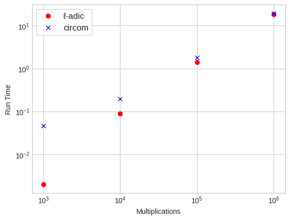
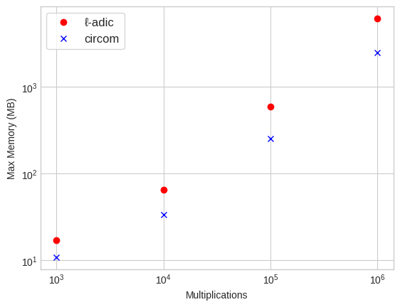
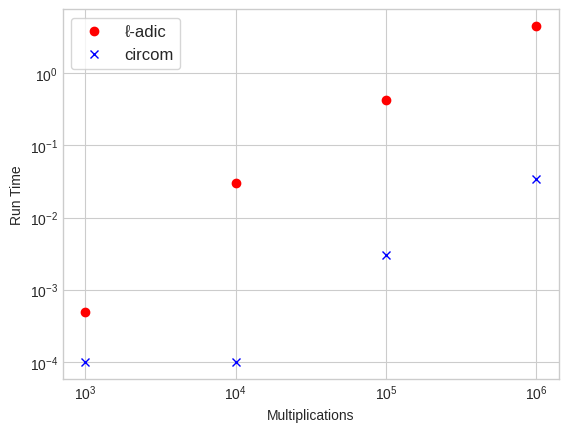
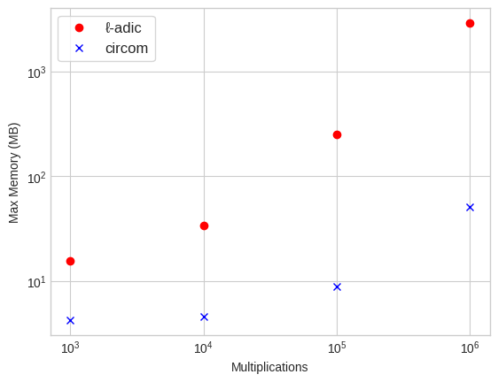

# Benchmarks

We present some benchmark results for a simple factorial like program. The circuit takes one input `start`, a parameter `n`, and returns the `n`-fold product `out`

```
out = start * (start + 1) * ... * (start + (n - 1))
```

We are interested in benchmarking the `compile` and `solve` commands for this circuit. In the case of `circom`, the benchmarks are performed against the `c++` generated solver code.

## Caveats
This is not an apples-to-apples comparison. It's important to highlight some differences underlying these results that lie outside the respective implementations:

### compile

1. Circom is not an embedded DSL. This is obvious, but it also means that the `compile` benchmarks include reading the source files, parsing, lexing etc. As `ℓ-adic` circuits are implemented as an embedded DSL, you are skipping this step and constructing the AST directly. I have not benchmarked the circom compiler to determine what kind of difference this makes, but presumably it gets worse for more compilcated programs than the one used in these benchmarks.
   
2. Haskell has a sophisticated runtime which also includes garbage collection. It is well documented that Rust outperforms Haskell (and most other runtime languages) in terms of memory footprint, so no news here. Additionally Haskell is lazy, which can make maximum memory footprint even worse unless intentional strictness is use to combat this.
   
### solve

1. The ℓ-adic compiler is outputing the compiled constraints to a binary file and parsing this file when running the solver. In contrast, circom is generating solver source code directly (either `c++` or `wasm`). Using the GHC profiler, I have deduced that for the solver about 50% the run time is spent reading and parsing this file, which is pretty significant. For the compile phase, only about 5-7% of the runtime is spent writing this file.
   
2. Similar comments about the runtime apply -- the generated `c++` solver code is likely to outperform any Haskell implementation even with extreme manual optimizations.

## Results


### compile



Asymptotically the two compile phases perform about the same, with a noticable advantage for the ℓ-adic compiler for small `n`. It's possible you could contribute this to the embedded-DSL caveat mentioned above.

### compile memory



The max memory footprint plot shows about a constant `2x` memory requirement for the ℓ-adic implementaion. This is about what you would expect given the difference in implementation languages.

### solve




The `solve` plot shows that the circom `c++` solver is about 100x faster than the ℓ-adic solver. Some of this is surely attributable to the caveat comments above, but I am not able to comment on the different implementations that could explain more. 

### solve memory



The memory plot is a bit more concerning -- the ratio is not a constant multiple but seems to be increasing with `n`. Further work is required in order to bring this back down, but my current guess is that some large lazy thunk is constructed unintentionally.


## Steps to Reproduce
These are the instructions if you want to reproduce these results on some other machine:

### Requirements
- cabal
- circom

In order to run the compiler/solver, you need to first build and install the cli for the haskell circuit:

```
> cd l-adic
> cabal install large-mult-cli
```

If you would like to change the number of multiplications, you will need to edit the files
- `l-adic/cli/Main.hs`
- `circom/large-mult.circom`

to change the argument. It should be clear from the code where to do this.

### Run a Benchmark
To collect benchmark you use the python script `benchmark.py`, e.g.

```
> python3 benchmark.py "large-mult-cli compile" -r 10
```

or the circom equivalent

```
> python3 benchmark.py "circom circom/large-mult.circom --c --r1cs --sym" -r 10
```

The `-r` indicates the number of iterations to run. You should see an output like:

```
Real Time (seconds):
  Mean: 0.111
  Median: 0.110
  Stddev: 0.003
User Time (seconds):
  Mean: 0.090
  Median: 0.090
  Stddev: 0.007
System Time (seconds):
  Mean: 0.017
  Median: 0.020
  Stddev: 0.005
Max Memory (KB):
  Mean: 65673.20
  Median: 65712.00
  Stddev: 84.01
```

The benchmarks were plotted according to `User Time`, with the understanding that `User Time + System Time = Real Time`. You can see the results collected for this report in e.g. `l-adic-results.txt`.

### Plot
The `plot.py` script contains the code to plot the results, they were rendered via a python notebook.
